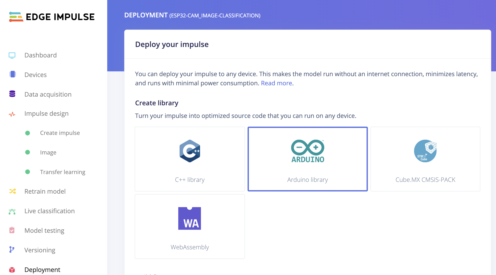
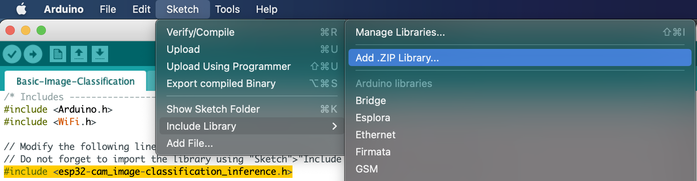
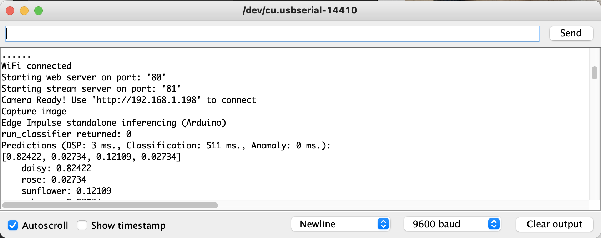
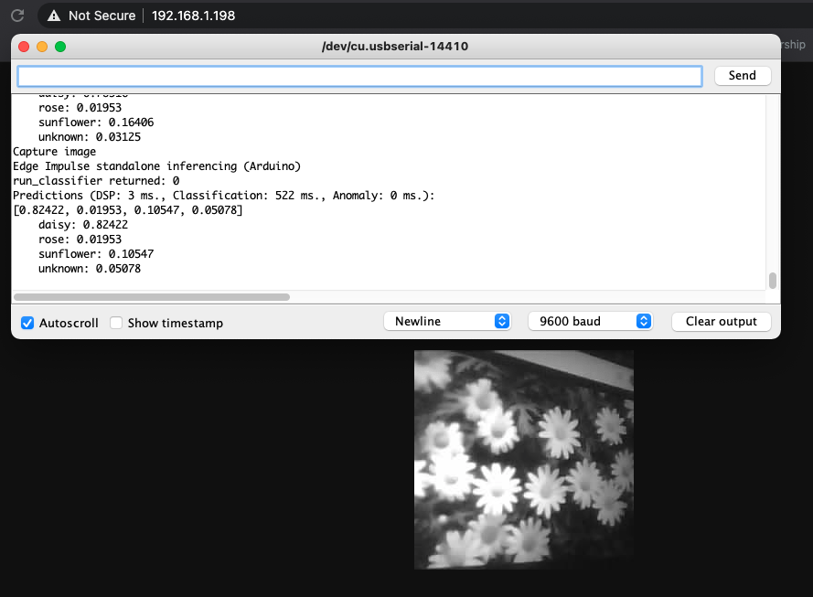

# ESP32 Cam and Edge Impulse

How to run custom inference on a ESP32 cam using Edge Impulse. 

*Note: I've used this tutorial to get started: [TinyML ESP32-CAM: Edge Image classification with Edge Impulse](https://www.survivingwithandroid.com/tinyml-esp32-cam-edge-image-classification-with-edge-impulse/)*

### Material


I have been testing the code using the AI Thinker ESP32 Cam module. It should work the same with the Wrover board. To use this board, please select your board in the Arduino code the following lines:

```
// Select camera model

#define CAMERA_MODEL_WROVER_KIT // Has PSRAM
//#define CAMERA_MODEL_ESP_EYE // Has PSRAM
//#define CAMERA_MODEL_M5STACK_PSRAM // Has PSRAM
//#define CAMERA_MODEL_M5STACK_V2_PSRAM // M5Camera version B Has PSRAM
//#define CAMERA_MODEL_M5STACK_WIDE // Has PSRAM
//#define CAMERA_MODEL_M5STACK_ESP32CAM // No PSRAM
//#define CAMERA_MODEL_AI_THINKER // Has PSRAM
//#define CAMERA_MODEL_TTGO_T_JOURNAL // No PSRAM
```

## Steps

* Create your model using [Edge Impulse](https://edgeimpulse.com)
* Download the Arduino library under the `Deployment` tab in the Edge Impulse studio

* Open the `Basic-Image-Classification.ino` file under the `/Basic-Image-Classification` folder.
* Import the .zip library you have downloaded from Edge Impulse Studio

* Change the `#include <esp32-cam_image-classification_inference.h>` line according to your project name.
* Compile and deploy the code to your board
* Open the serial monitor and use the provided IP to capture an image and run the inference:


